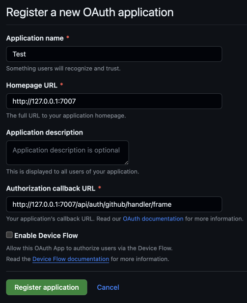
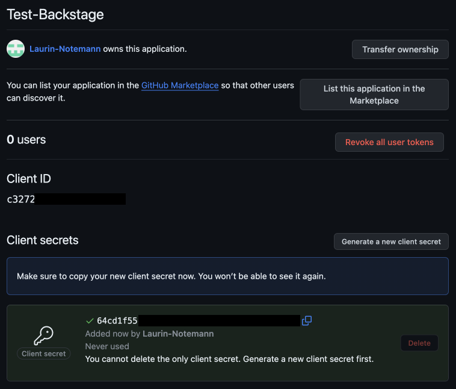
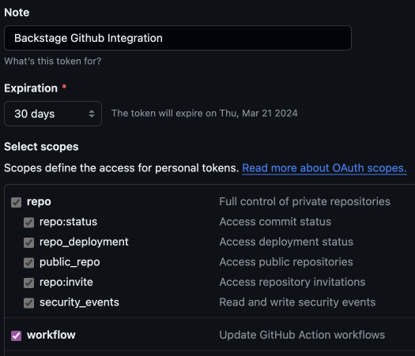

### [Backstage](https://backstage.io)

# Setup for code-idp as a developer:

Prerequisites:
- Node 18.20
<details>
<summary>Installing Node 18.20 (using NVM)</summary>
<br>
To install node and npm in Ubuntu on WSL you need to install nvm. It doesn't work with apt-install.
Install NVM:

```sh 
curl -o- https://raw.githubusercontent.com/creationix/nvm/v0.33.0/install.sh | bash
```

Edit ~/.bashrc or ~/.zshrc depending on the Linux Shell you're using and add the following at the bottom.

```sh 
export NVM_DIR="/home/yourusername/.nvm" [ -s "$NVM_DIR/nvm.sh" ] && \. "$NVM_DIR/nvm.sh"
```

Restart your shell and docker after this step. 
<br>
nvm install node version 18.20.3

```sh 
nvm install v18.20.3
```

</details>

- [Yarn 1 "Classic"](https://classic.yarnpkg.com/lang/en/docs/install/)
- [Docker Desktop](https://www.docker.com/products/docker-desktop/)

<details>
<summary>Installing Docker on WSL or Linux</summary>
<br>
For Linux, follow this [link](https://docs.docker.com/engine/install/ubuntu/) for Ubuntu Docker install.
<br>

For WSL, use this [link](https://docs.docker.com/desktop/wsl/) (do not install docker on the linux distro on WSL.)

<br>
Notes:
</details>


Clone the repository and install node_modules:
```sh  
git clone https://github.com/codeuniversity/code-idp

cd code-idp

yarn
```

Setup environment variables using .env and app-config.local.yaml:
```sh 
cp .env.example .env

cp .example.app-config.yaml app-config.local.yaml
```

These two newly created files `.env` and ` app-config.local.yaml` are for your secrets and local configurations. These files do not get pushed to the GitHub repository and are safe to use. 

# More on Environment variables

The following environment variables are currently used, please make sure they are in your .env:
```
POSTGRES_HOST="backstage_postgres"
POSTGRES_PORT="5432"
POSTGRES_USER="postgres"
POSTGRES_PASSWORD="admin"

BASE_URL="http://localhost:7007"

GOOGLE_CLIENT_ID= "google_client_id"
GOOGLE_CLIENT_SECRET= "google_client_secret"

GITHUB_TOKEN="your-token"
```

<details>
<summary>Details to the environment variables</summary>
<br>

**`POSTGRES`:**
<br>
All of the environment variables prefixed with POSTGRES_ should stay like they are in the .env.example for the optimal setup experince and only be changed if you know what you are doing.

**`BASE_URL`:**
<br>
Keep it the same as it is right now, this is the url on which the application is running. 

**`GOOGLE_CLIENT`:**
<br>
These environment variables are to allow google login with your code.berlin email.
( https://console.cloud.google.com/apis/credentials/oauthclient/1006240973223-fs36u8kllipl761732fn565l6suviroh.apps.googleusercontent.com?authuser=0&project=code-idp&pli=1 )
Use the link above and copy the client ID and secret.

**`GITHUB_TOKEN`:**
<br>
This environment variable is to configure the [GitHub integration](https://backstage.io/docs/getting-started/configuration#setting-up-a-github-integration), 
so that Backstage can interact with your GitHub account and for example create a repository for you. Please follow [these](#github-integration) steps for the setup.
</details>

# Setup Essentials
The following setup steps are necessary to ensure that you have basic functionality in your app starting with
a proper database, using docker set up a postgres db, after that setting aber GitHub authentication and the GitHub
Integration so that you can interact with Github.

## Setup database (with `docker`)
To start the database with docker run the following command:
```sh
yarn docker:start-database
```
This will create a new database container with the name `backstage_postgres` exposed on local port 5433. This non-standard port is chosen on purpose to not conflict with other postgres instances which may be running locally.

## GitHub Auth
To setup you GitHub authentication follow these steps:

1. Go to https://github.com/settings/applications/new
2. Enter an `Application name` (can be anything)
3. Enter `http://127.0.0.1:7007` for `Homepage URL`
4. Enter `http://127.0.0.1:7007/api/auth/github/handler/frame` for `Authorization callback URL`
<br>
It should look like this (yes you can leave Enable Device Flow off for now):
<br>


5. After clicking on `Register Application` click on `Generate a new client secret`, and then your screen should look like this:
<br>


6. Now copy and paste your `Client ID` and your `Client secret` into the correct environment variables (`GITHUB_CLIENT_ID` and `GITHUB_CLIENT_SECRET`).

## GitHub Integration
To get you GitHub integration working you need to generate yourself a new token like so:

1. Go to https://github.com/settings/tokens/new
2. Write a note (can be empty but encourged so you know what the tokens belongs to)
3. Set an expiration date (can be unlimited just be careful not to share it or you might have to revoke it manully)
4. Select a scope the following is enough for basic usage (may have to adjusted if you want to go beyong the basic scope)



5. Copy and paste your `GitHub Token` and paste it into the correct environment variable (`GITHUB_TOKEN`)

6. follow this guide in order to authorize your token: https://docs.github.com/en/enterprise-cloud@latest/authentication/authenticating-with-saml-single-sign-on/authorizing-a-personal-access-token-for-use-with-saml-single-sign-on

# Running Environments
If you have followed the essential setup steps ([Setup database](#setup-database-with-docker), [GitHub Auth](#github-auth) and [GitHub Integration](#github-integration)) 
then you can decide where you to run backstage:

1. [locally](#running-with-yarn-dev) with `yarn dev` (recommended for regular development due to short waiting time on changes)
2. inside of a [docker container](#running-with-docker-compose) (recommended only to test certain environments due to high waiting time because of high image build time (up to 5 mins))
<br>
 !! Note this is based on assumption that we will host `Backstage` inside of the Kubernetes cluster where we host the other dev projects

## Running with `yarn dev`
Run this command in the root directory of the project:
```sh
yarn dev
```
This should automatically open your browser with the correct url, otherwise open `http://127.0.0.1:3000` in your browser.

Note that when you run with `yarn dev`, hot reload is running on certain parts of the application, meaning that the page in the browser will automatically update if you change the code.  If however you need to force the app to restart simply press C-c (control-c) to interrupt the program and run `yarn dev` again. 

> Note you don't need to setup up a local `Kubernetes` environment if you do not specifically need to work with Kubernetes entities (This was written on the 20.02.2024 so possibly subject to change).

## Running with `docker compose`
For first use and **every time** you change something in the project (except the value of an environment variable) run:
```sh  
yarn docker:run-build-backstage
```

This will build the image (which *can* take up to 5-10 mins depending on your machine) and then start a new docker container in the same network docker network as the postgres database is.

To open Backstage in the browser now open `http://127.0.0.1:7007`.

If you want simply run the docker container again without rebuilding it (reminder any changes you did are not applied then) run:
```sh  
yarn docker:run-backstage
```

To stop the Backstage container run (simply run `yarn docker:run-backstage` to start the container again):
```sh  
yarn docker:stop-backstage
```

To remove the Backstage container run:
```sh  
yarn docker:remove-backstage
```

To remove all containers (**IMPORTANT** this also removes the database container meaning even `yarn dev` won't work) run:
```sh  
yarn docker:remove-all
```

# Configuration
To get a better understanding of how the app-config.yaml files work please refer to [this](https://backstage.io/docs/conf/writing).
Specifically the part about the [config files](https://backstage.io/docs/conf/writing#configuration-files) is important to understand.

The following explanation will go more into detail about how we use them in our project but expects you to understand how they work in general:

Currently we have:
- app-config.yaml
- app-config.local.yaml
- app-config.docker.yaml
- app-config.production.yaml

**`app-config.yaml`:**
<br>
This is the basic configuration that get applied to all of our environments and should contain the bases for all environments. 
If you need to change something for all environments please add/delete or update them here in this file.

**`app-config.local.yaml`:**
<br>
All attributes in this file overwrite the `app-config.yaml` attributes when you run [locally](#running-with-yarn-dev).
Currently we are only specifing the database host and port because they slightly different in our .env file, which is designed to work for the docker compose.

**`app-config.docker.yaml`:**
<br>
This file changes some base values that are necessary to build the correct image and it currently changes attributes such as:
- baseUrl because the docker image bundles the frontend into the backend -> therefore we only have one 
- auth.github because we set the NODE_ENV to production for the image 
- catalog because it interprets the paths from local directories differently in the image

# Testing

Before committing your changes, run the tests pls. ✨

```sh
yarn test
```

to run tests without end to end testing run:

```sh
yarn test:no-e2e
```
