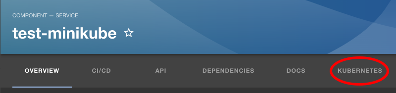

### [Backstage](https://backstage.io)

# Setup for code-idp as a developer:

Clone the repository and install node_modules:
```sh  
git clone https://github.com/codeuniversity/code-idp

cd code-idp

yarn
```

Setup environment variables using .env and app-config.local.yaml:
```sh 
cp .env.example .env

cp .example.app-config.yaml app-config.local.yaml
```

These are the two file where you can put your secrets. These file DO NOT get pushed to the GitHub repository.

# More on Environment variables

The following environment variables are currently used, please make sure they are in your .env:
```
POSTGRES_HOST="backstage_postgres"
POSTGRES_PORT="5432"
POSTGRES_USER="postgres"
POSTGRES_PASSWORD="admin"

BASE_URL="http://localhost:7007"

GITHUB_CLIENT_ID="your-id"
GITHUB_CLIENT_SECRET="your-secret"

GITHUB_TOKEN="your-token"

K8S_URL="k8s-url"
K8S_ACCOUNT_TOKEN="k8s-account-token"
K8S_CA_DATA="k8s-ca-data"
K8S_CA_FILE="k8s-ca-file"
```

<details>
<summary>Details to the environment variables</summary>
<br>

**`POSTGRES`:**
<br>
All of the environment variables prefixed with POSTGRES_ should stay like they are in the .env.example for the optimal setup experince and only be changed if you know what you are doing.

**`BASE_URL`:**
<br>
Keep it the same as it is right now, this is the url on which the application is running. 

**`GITHUB_CLIENT`:**
<br>
These environment variables are to setup correct [authentication](https://backstage.io/docs/getting-started/configuration#setting-up-authentication). Please follow [these](#github-auth) steps.

**`GITHUB_TOKEN`:**
<br>
This environment variable is to configure the [GitHub integration](https://backstage.io/docs/getting-started/configuration#setting-up-a-github-integration), 
so that Backstage can interact with your GitHub account and for example create a repository for you. Please follow [these](#github-integration) steps for the setup.

**`K8S_URL`:**
<br>
These environment variables are to configure the [kubernetes plugin](https://backstage.io/docs/features/kubernetes/). 
To setup you local minikube environment follow [these](#kubernetes) steps.
</details>

# Setup Essentials
The following setup steps are necessary to ensure that you have basic functionality in your app starting with
a proper database, using docker set up a postgres db, after that setting aber GitHub authentication and the GitHub
Integration so that you can interact with Github.

## Setup database (with `docker`)
To start the database with docker run the following command:
```sh
yarn docker:start-database
```
This will create a new database container with the name `backstage_postgres` and it exposes the port 5433 <- this is done on purpose in case somebody has postgres running locally.

## GitHub Auth
To setup you GitHub authentication follow these steps:

1. Go to https://github.com/settings/applications/new
2. Enter an `Application name` (can be anything)
3. Enter `http://127.0.0.1:7007` for `Homepage URL`
4. Enter `http://127.0.0.1:7007/api/auth/github/handler/frame` for `Authorization callback URL`
<br>
It should look like this (yes you can leave Enable Device Flow off for now):
<br>


5. After clicking on `Register Application` click on `Generate a new client secret`, and then your screen should look like this:
<br>


6. Now copy and paste your `Client ID` and your `Client secret` into the correct environment variables (`GITHUB_CLIENT_ID` and `GITHUB_CLIENT_SECRET`).

## GitHub Integration
To get you GitHub integration working you need to generate yourself a new token like so:

1. Go to https://github.com/settings/tokens/new
2. Write a note (can be empty but encourged so you know what the tokens belongs to)
3. Set an expiration date (can be unlimited just be careful not to share it or you might have to revoke it manully)
4. Select a scope the following is enough for basic usage (may have to adjusted if you want to go beyong the basic scope)

5. Copy and paste your `GitHub Token` and paste it into the correct environment variable (`GITHUB_TOKEN`)

# Running Environments
If you have followed the essential setup steps ([Setup database](#setup-database-with-docker), [GitHub Auth](#github-auth) and [GitHub Integration](#github-integration)) 
then you can decide where you to run backstage:

1. [locally](#running-with-yarn-dev) with `yarn dev` (recommended for regular development due to short waiting time on changes)
2. inside of a [docker container](#running-with-docker-compose) (recommended only to test certain environments due to high waiting time because of high image build time (up to 5 mins))
3. inside of [minikube](#running-with-minikube) (only recommended to test to be the closest to the actual production environment (for testing))
<br>
 !! Note this is based on assumption that we will host `Backstage` inside of the Kubernetes cluster where we host the other dev projects

## Running with `yarn dev`
Run this command in the root directory of the project:
```sh
yarn dev
```
This should automatically open your browser with the correct url, otherwise open `http://127.0.0.1:3000` in your browser.
When you run with `yarn dev` you have hot reload on certain parts -> meaning the page in the browser will automatically update if you changed something 
if you need to force the app to restart simply press C-c (control-c) to interrupt the program and run `yarn dev` again

> Note you don't need to setup up a local `Kubernetes` environment if you do not specifically need to work with Kubernetes entities (This was written on the 20.02.2024 so possibly subject to change).

## Running with `docker compose`
For first use and **every time** you change something in the project (except the value of an environment variable) run:
```sh  
yarn docker:run-build-backstage
```

This will build the image (which *can* take up to 5-10 mins depending on your machine) and then start a new docker container in the same network docker network as the postgres database is.

To open Backstage in the browser now open `http://127.0.0.1:7007`.

If you want simply run the docker container again without rebuilding it (reminder any changes you did are not applied then) run:
```sh  
yarn docker:run-backstage
```

To stop the Backstage container run (simply run `yarn docker:run-backstage` to start the container again):
```sh  
yarn docker:stop-backstage
```

To remove the Backstage container run:
```sh  
yarn docker:remove-backstage
```

To remove all containers (**IMPORTANT** this also removes the database container meaning even `yarn dev` won't work) run:
```sh  
yarn docker:remove-all
```

# Kubernetes
The following talks about two different topics (it is highly encourged to watch a short [tutorial](https://www.youtube.com/watch?v=PziYflu8cB8) on Kubernetes before continuing):

1. How to setup minikube and how to use Backstage to monitor pods that are running inside of Kubernetes.
2. How to run Backstage itself inside of the minikube cluster (and still be able to monitor the pods that are running in Kubernetes, which means the first step is a pre-requisite of this step).
The reason for having the second step is more for testing purposes because this setup is the closest to the actual production environment 

> Note again here the second step is only true if we actually host Backstage in the same cluster as the other deployments

## Setup with `minikube`
Pre-requisite: Docker installed

To setup minikube and the [Kubernetes plugin](https://backstage.io/docs/features/kubernetes/) so that we can monitor Kubernetes pods 
through Backstage we need to do the following:
1. Install `kubectl`
    <br>
    1.1 Install the correct version of `kubectl` depending on your operation system: [linux](https://kubernetes.io/docs/tasks/tools/install-kubectl-linux/), 
    [macOS](https://kubernetes.io/docs/tasks/tools/install-kubectl-macos/) or [windows](https://kubernetes.io/docs/tasks/tools/install-kubectl-windows/). On macOS installing with
    homebrew is recommended by me.
    <br>
    1.2 Quick Note about `kubectl`: `kubectl` is the cli tool that can interact with an existing Kubernetes cluster and it has different `contexts` for different cluster. 
    If this is your first time installing `kubectl` and you most likely do not have a cluster that you are connected to at this point, we will set up a local cluster with `minikube`
    in the following setup, and that will automatically set your context to the correct cluster (in this case `minikube`).
    To see all your contexts run `kubectl config get-contexts`.
2. Install `minikube`
    <br>
    2.1 Follow [this guide](https://minikube.sigs.k8s.io/docs/start/#installation) to install minikube and also how to run minikube inside of a docker, make sure you install minikube for the correct system.
    Installing on macOS with homebrew is recommended by me.
    <br>
    2.2 Start minikube clutser with `minikube start` (can take a few minutes)
    <br>
    NOTE: If you have installed kubectl, `minikube start` will automatically set your current context to the `minikube` context!
    <br>
    2.3 To test if the installation worked run: `kubectl get pods -A` and you should have an output similiar to this:
    ```
    NAMESPACE     NAME                               READY   STATUS    RESTARTS        AGE
    kube-system   coredns-5d78c9869d-4jq4h           1/1     Running   0               9m43s
    kube-system   etcd-minikube                      1/1     Running   0               9m56s
    kube-system   kube-apiserver-minikube            1/1     Running   0               9m58s
    kube-system   kube-controller-manager-minikube   1/1     Running   0               9m58s
    kube-system   kube-proxy-8dzhs                   1/1     Running   0               9m44s
    kube-system   kube-scheduler-minikube            1/1     Running   0               9m56s
    kube-system   storage-provisioner                1/1     Running   1 (9m39s ago)   9m56s
    ```
3. Setup `minikube` for Backstage
    <br>
    <br>
    **3.1 Create a service account so that backstage can access the cluster**
    ```sh
    kubectl apply -f minikube/clusterrolebinding.yaml

    kubectl get secrets cluster-admin-secret -o jsonpath="{.data['token']}" | base64 --decode; echo
    ```
    copy and paste that token in the K8S_ACCOUNT_TOKEN environment variable in your .env
    <br>
    <br>
    **3.2 Get the certificate authority for minikube**
    ```sh
    cat ~/.minikube/ca.crt | base64
    ```
    copy and paste that certificate in the K8S_CA_DATA environment variable in your .env
    <br>
    <br>
    **3.3 Get the URL that `minikube` is running on**
    ```sh
    kubectl cluster-info
    ```
    copy and paste the first URL in the K8S_URL environment variable in your .env
    <br>
    <br>
    **3.4 Run pod in `minikube` to be inspected by `Backstage`**
    ```sh
    kubectl apply -f minikube/test-deployment.yaml
    ```
    
> NOTE: we leave the K8S_CA_FILE environment variable empty for now because that is only needed if you run Backstage in the cluster, 
for now it is recommended only to run it [locally](#running-with-yarn-dev) or run in [docker](#running-with-docker-compose) to be able to run it inside of minikube read [here](#running-with-minikube)

4. [Run](#running-environments) backstage (recommended [locally](#running-with-yarn-dev))
    <br>
    NOTE: If you want to run backstage inside of the docker container you need to change the K8S_URL variable to: https://host.docker.internal:[YOUR-PORT]
    <br>

    4.1 Click on `test-minikube`
    <br>
    

    4.2 Click on `Kubernetes`
    <br>
    

    4.3 Now you should see this:
    <br>
    
    
5. To see how you can expose your own Backstage entities follow 
[this](https://backstage.io/docs/features/kubernetes/configuration#surfacing-your-kubernetes-components-as-part-of-an-entity) guide

## Running with `minikube` 
Work in progress -> Not necessary for development right now.

# Configuration
To get a better understanding of how the app-config.yaml files work please refer to [this](https://backstage.io/docs/conf/writing).
Specifically the part about the [config files](https://backstage.io/docs/conf/writing#configuration-files) is important to understand.

The following explanation will go more into detail about how we use them in our project but expects you to understand how they work in general:

Currently we have:
- app-config.yaml
- app-config.local.yaml
- app-config.docker.yaml
- app-config.production.yaml

**`app-config.yaml`:**
<br>
This is the basic configuration that get applied to all of our environments and should contain the bases for all environments. 
If you need to change something for all environments please add/delete or update them here in this file.

**`app-config.local.yaml`:**
<br>
All attributes in this file overwrite the `app-config.yaml` attributes when you run [locally](#running-with-yarn-dev).
Currently we are only specifing the database host and port because they slightly different in our .env file, which is designed to work for the docker compose.

**`app-config.docker.yaml`:**
<br>
This file changes some base values that are necessary to build the correct image and it currently changes attributes such as:
- baseUrl because the docker image bundles the frontend into the backend -> therefore we only have one 
- auth.github because we set the NODE_ENV to production for the image 
- catalog because it interprets the paths from local directories differently in the image

**`app-config.production.yaml`:**
<br>
This file adds one line to the kubernetes plugin setup, which is only needed if the app is hosted inside of a kubernetes cluster.
